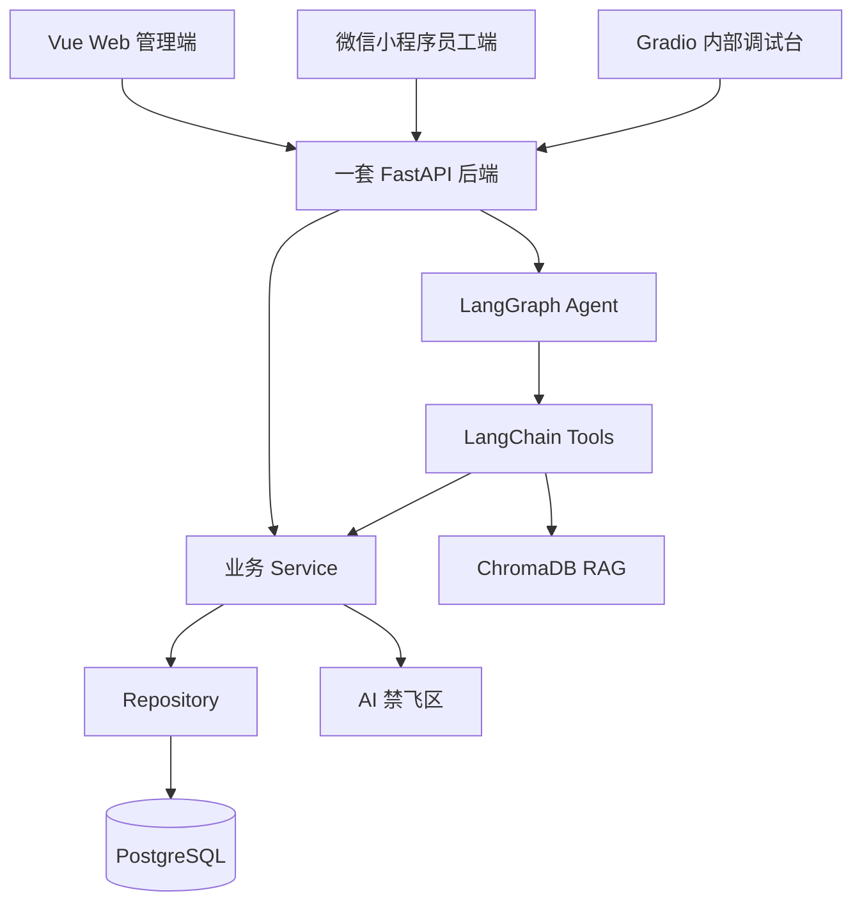

# TalentFlow 架构说明

## 总体架构

TalentFlow 智聘中枢采用 Vue Web 管理端、微信小程序员工端、Gradio 内部调试台和一套 FastAPI 后端。后端采用模块化单体，统一连接 PostgreSQL、ChromaDB RAG、LangGraph Agent 和 AI 禁飞区。

## 固定约束

- 一套 FastAPI 后端。
- Web、小程序、Gradio 共享后端。
- 普通业务：`API -> Service -> Repository -> PostgreSQL`。
- Agent：`Agent -> Tool -> Service -> human_only`。
- 模块化单体，不使用微服务。
- 不新增第二套后端。

## 架构图

## Web、员工端、小程序边界

- Web 管理端：招聘、候选人、排期、薪资预审、审计、驾驶舱和员工服务。
- Web 员工侧：考勤、年假、本人薪资、制度查询和员工服务 Agent。
- 小程序：仅员工端简单功能，包括首页、签到、签退、今日考勤、本月考勤、年假余额、本人薪资摘要和制度查询。
- 小程序不接 HR 招聘、排期、薪资预审和审计后台。

## 考勤到薪资预审数据流

1. 员工签到或签退。
2. 后端记录考勤事实和状态。
3. HR 查看月度考勤汇总。
4. 薪资预审读取考勤事实和月度汇总。
5. 规则引擎生成预审明细。
6. AI 解释异常和提供审查建议。
7. HR 执行最终确认。

## 薪资预审与确认分离

- 规则引擎负责计算。
- AI 负责解释和建议。
- HR 负责确认。
- Agent 不得确认工资、修改工资、删除扣款或写入已确认薪资。

## Gradio 定位

Gradio 仅用于内部 Agent 调试，查看 LangGraph 执行链、工具调用、RAG 命中、错误信息和 Trace。

## 数据库模型基线

- SQLAlchemy 基线入口：`backend/app/core/database.py`。
- 模型注册入口：`backend/app/modules/model_registry.py`。
- 业务模型位置：`backend/app/modules/*/models.py`。
- 首次迁移：`backend/alembic/versions/0001_initial_schema.py`，迁移编号 `0001_initial_schema`。
- 当前迁移只建立表结构、外键、唯一约束、检查约束和索引，不写入种子数据。
- 本次未执行 `alembic upgrade head`，实际数据库升级由人工在本地环境确认后执行。
