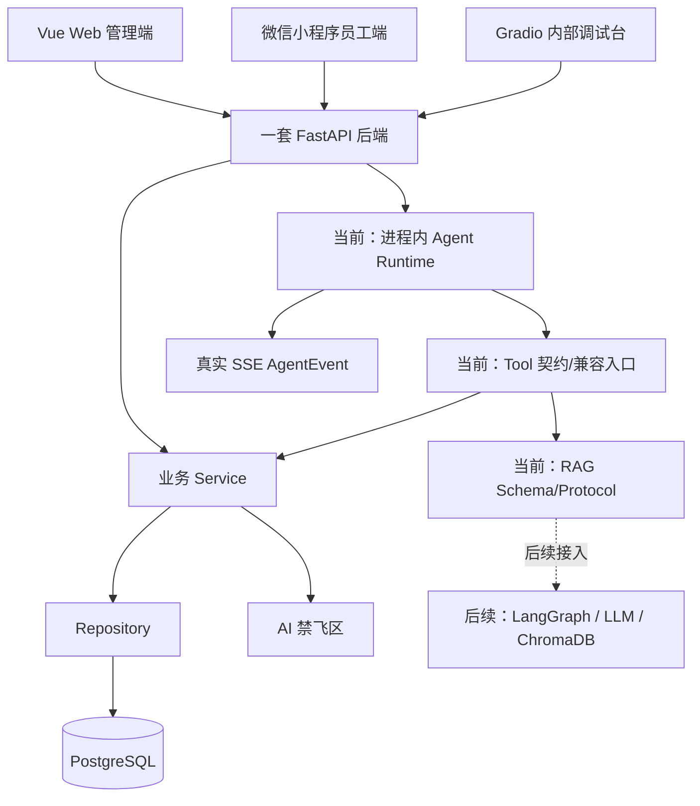

# TalentFlow 架构说明

## 总体架构

TalentFlow 智聘中枢采用 Vue Web 管理端、微信小程序员工端、Gradio 内部调试台和一套 FastAPI 后端。后端采用模块化单体。Sprint 2.2 的有界进程内 Runtime、SSE、招聘策略、企业知识本地回退和确定性简历解析代码存在，待本地人工验收；LangGraph、LLM、真实 RAG 和 Gradio Agent 执行为计划中。

## 固定约束

- 一套 FastAPI 后端。
- Vue Web 管理端、微信小程序员工端、Gradio 内部调试台共享同一套 FastAPI 后端。
- 普通业务请求：`API -> Service -> Repository -> PostgreSQL`。
- 普通业务调用核心算法：`API -> Service -> human_only`。
- Agent 任务调用核心算法：`Agent -> Tool -> Service -> human_only`。
- RAG 问答：`Agent/Tool -> RAG -> ChromaDB -> LLM -> 带来源回答`。
- 模块化单体，不使用微服务。
- 不新增第二套后端。
- 不引入 Redis、Celery、RabbitMQ、Kubernetes，除非后续团队明确重新决策并更新 `.agent/decisions.md`。
- Route/API 不直接访问数据库，不直接调用 `human_only`。
- Agent 不直接访问 Repository，不直接调用 `human_only`。
- 前端、小程序、Gradio 不直接访问数据库、禁飞区或底层算法。

## 架构图

## AI 禁飞区边界

AI 禁飞区核心实现文件只包含：

- `backend/app/human_only/resume_scoring.py`
- `backend/app/human_only/interview_scheduler.py`
- `backend/app/human_only/salary_access_control.py`

对应核心测试只包含：

- `backend/tests/human_only/test_resume_scoring.py`
- `backend/tests/human_only/test_interview_scheduler.py`
- `backend/tests/human_only/test_salary_access_control.py`

AI 不得创建、修改、移动、删除、格式化、补全上述文件，不得复制、重写、模拟、绕过禁飞区核心算法。禁飞区只能由人工负责人维护，保持纯 Python，不依赖 FastAPI、SQLAlchemy、LangGraph、ChromaDB、HTTP 客户端、数据库连接或 LLM。

`human_only` 内部公开函数统一为 `score_resume(...)`、`schedule_interview(...)`、`check_salary_access(...)`。Service 层可以包装为 `score_candidates(...)`、`generate_schedule(...)`、`check_salary_access(...)`。Agent Tool 只能调用 Service 层函数。

## Web、员工端、小程序边界

- Web 管理端：招聘、候选人、排期、薪资预审、审计、驾驶舱和员工服务。
- Web 员工侧：考勤、年假、本人薪资、制度查询和员工服务 Agent。
- 小程序：仅员工端简单功能，包括首页、签到、签退、今日考勤、本月考勤、年假余额、本人薪资摘要和制度查询。
- 小程序不接 HR 招聘、排期、薪资预审和审计后台。

## 考勤到薪资预审数据流

1. 员工签到或签退。
2. 后端记录考勤事实和状态。
3. HR 查看月度考勤汇总。
4. 薪资预审读取考勤事实和月度汇总。
5. 规则引擎生成预审明细。
6. AI 解释异常和提供审查建议。
7. HR 执行最终确认。

## 薪资预审与确认分离

- 规则引擎负责计算。
- AI 负责解释和建议。
- HR 负责确认。
- Agent 不得确认工资、修改工资、删除扣款或写入已确认薪资。

## Gradio 定位

Gradio 仅用于内部 Agent 调试。LangGraph 执行链、真实工具调用和 RAG 命中展示属于后续能力；当前不将调试骨架描述为已接入。

## Sprint 2.2 Agent Runtime（代码存在，待本地人工验收）

- API 通过 `RecruitmentRunContextService -> RecruitmentService/InterviewService -> Repository` 校验真实岗位、候选人、投递关系和已有面试记录，并生成最小白名单上下文。
- Runner 只接收脱离数据库 Session 的 Pydantic 上下文，不访问 Repository 或 `human_only`。
- RunStore 使用 `asyncio.Lock`、最多 100 个 Run、每个 Run 最多 500 条事件，并清理超过两小时的终止 Run。
- Run 归创建用户所有，其他用户按不可见策略返回 `AGENT_RUN_NOT_FOUND`。
- Snapshot 保存规范化招聘目标、岗位摘要、候选人 ID 范围、当前候选人、节点状态、候选人画像、Rubric、知识摘要、事件和来源引用。
- 知识 Tool 只调用 `RecruitmentKnowledgeService`，明确使用 `LOCAL_HYBRID_FALLBACK`，返回版本、生效日期和有限来源摘录，不声称 ChromaDB 已运行。
- 简历 Tool 只调用 `ResumeProfileService`，逐候选人返回白名单画像、有限证据和未知字段；简历中的指令文本不改变系统规则。
- `AGENT_THINKING` 仅为可审计结构化摘要，不是隐藏思维链。
- 当前执行招聘策略与简历解析 Agent；岗位匹配、面试评价、决策审查和 HR 报告以 `CURRENT_PHASE_NOT_IMPLEMENTED` 标记为 `SKIPPED`。
- SSE 先重放历史事件，再发送新增事件；终止后关闭。进程重启后 Run 会丢失。
- 前端总体状态、节点卡片、节点详情和事件流只消费 Snapshot 与真实事件；无 Tool/RAG 时显示未调用或未检索，失败时显示安全的节点和步骤。

## 长期多 Agent 架构与目录职责

正式招聘链路为“企业招聘目标 → 招聘策略 Agent → 简历解析 / 岗位匹配 / 面试评估 → 决策审查 → HR 最终报告 → HR 人工决定”。当前招聘策略和确定性简历解析执行代码存在，待本地人工验收；岗位匹配及后续节点已建立目录或契约，不能解释为真实 Agent 能力。

- `agents/runtime/`：当前进程内运行、事件存储和 SSE。
- `agents/shared/`：状态、事件、来源引用、Guardrail 与模型网关契约。
- `agents/workflows/`：领域状态、节点元数据和未来工作流边界；当前不创建 LangGraph Graph。
- `agents/tools/`：Tool 契约与兼容入口，Agent 新代码只能经 Tool 调用 Service。
- `rag/`：摄取、检索、引用、向量存储 Schema/Protocol；当前没有 ChromaDB、Embedding 或真实知识索引。Sprint 2.2 本地知识回退位于招聘 Service。
- `modules/recruitment/intelligence/`：简历事实、技能标准化、证据、Rubric 与可信度纯数据契约。
- `modules/recruitment/services/`：当前真实 Run 上下文、企业知识本地回退、确定性简历画像 Service 与未来专业 Service Protocol。

未来接入 LangGraph、LLM 或真实 RAG 时，仍必须保留来源引用、可信度分解、隐私最小化、人工最终决定和兼容导入策略。

## 数据库模型基线

- SQLAlchemy 基线入口：`backend/app/core/database.py`。
- 模型注册入口：`backend/app/modules/model_registry.py`。
- 业务模型位置：`backend/app/modules/*/models.py`。
- 首次迁移：`backend/alembic/versions/0001_initial_schema.py`，迁移编号 `0001_initial_schema`。
- 当前迁移只建立表结构、外键、唯一约束、检查约束和索引，不写入种子数据。
- 本次未执行 `alembic upgrade head`，实际数据库升级由人工在本地环境确认后执行。

## Sprint 1 平台代码状态

- FastAPI 使用 JWT 确认身份，并在每次请求从数据库读取账号状态、角色、权限和关联员工档案；业务授权依据为 `users.permissions`。
- 招聘、面试、员工、考勤、薪资和审计已建立基础 Route -> Service -> Repository 只读链路。
- 演示种子数据放在 `data/seed/`，导入入口为 `scripts/build-demo-data.py` 和 `scripts/seed-data.ps1`。
- 薪资访问只通过 `PayrollAccessService` 调用人工禁飞区公开函数；禁飞区文件未提供时拒绝访问，不模拟核心算法。
