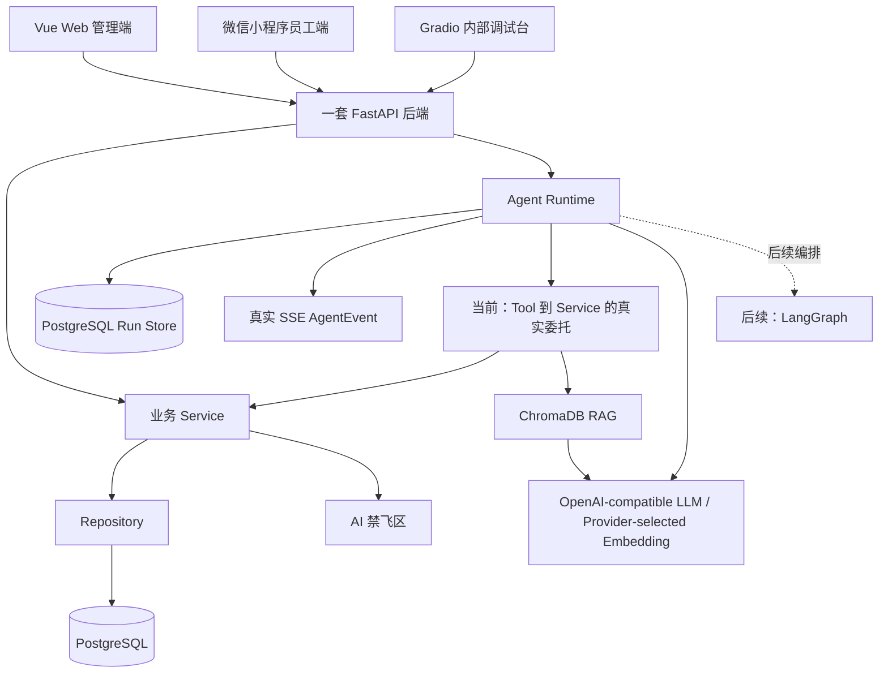

# TalentFlow 架构说明

## 总体架构

TalentFlow 智聘中枢采用 Vue Web 管理端、微信小程序员工端、Gradio 内部调试台和一套 FastAPI 模块化单体后端。PostgreSQL Agent Run 持久化、OpenAI-compatible 策略/报告增强、ChromaDB 企业知识检索、SSE 和前端恢复代码存在，待本地人工验收；LangGraph、真实面试评价 Agent 和 Gradio Agent 执行为计划中。

## 固定约束

- 一套 FastAPI 后端。
- Vue Web 管理端、微信小程序员工端、Gradio 内部调试台共享同一套 FastAPI 后端。
- 普通业务请求：`API -> Service -> Repository -> PostgreSQL`。
- 普通业务调用核心算法：`API -> Service -> human_only`。
- Agent 任务调用核心算法：`Agent -> Tool -> Service -> human_only`。
- RAG 问答：`Agent/Tool -> RAG -> ChromaDB -> LLM -> 带来源回答`。
- 模块化单体，不使用微服务。
- 不新增第二套后端。
- 不引入 Redis、Celery、RabbitMQ、Kubernetes，除非后续团队明确重新决策并更新 `.agent/decisions.md`。
- Route/API 不直接访问数据库，不直接调用 `human_only`。
- Agent 不直接访问 Repository，不直接调用 `human_only`。
- 前端、小程序、Gradio 不直接访问数据库、禁飞区或底层算法。

## 架构图

## AI 禁飞区边界

AI 禁飞区核心实现文件只包含：

- `backend/app/human_only/resume_scoring.py`
- `backend/app/human_only/interview_scheduler.py`
- `backend/app/human_only/salary_access_control.py`

对应核心测试只包含：

- `backend/tests/human_only/test_resume_scoring.py`
- `backend/tests/human_only/test_interview_scheduler.py`
- `backend/tests/human_only/test_salary_access_control.py`

AI 不得创建、修改、移动、删除、格式化、补全上述文件，不得复制、重写、模拟、绕过禁飞区核心算法。禁飞区只能由人工负责人维护，保持纯 Python，不依赖 FastAPI、SQLAlchemy、LangGraph、ChromaDB、HTTP 客户端、数据库连接或 LLM。

`human_only` 内部公开函数统一为 `score_resume(...)`、`schedule_interview(...)`、`check_salary_access(...)`。Service 层可以包装为 `score_candidates(...)`、`generate_schedule(...)`、`check_salary_access(...)`。Agent Tool 只能调用 Service 层函数。

## Web、员工端、小程序边界

- Web 管理端：招聘、候选人、排期、薪资预审、审计、驾驶舱和员工服务。
- Web 员工侧：考勤、年假、本人薪资、制度查询和员工服务 Agent。
- 小程序：仅员工端简单功能，包括首页、签到、签退、今日考勤、本月考勤、年假余额、本人薪资摘要和制度查询。
- 小程序不接 HR 招聘、排期、薪资预审和审计后台。

## 考勤到薪资预审数据流

1. 员工签到或签退。
2. 后端记录考勤事实和状态。
3. HR 查看月度考勤汇总。
4. 薪资预审读取考勤事实和月度汇总。
5. 规则引擎生成预审明细。
6. AI 解释异常和提供审查建议。
7. HR 执行最终确认。

## 薪资预审与确认分离

- 规则引擎负责计算。
- AI 负责解释和建议。
- HR 负责确认。
- Agent 不得确认工资、修改工资、删除扣款或写入已确认薪资。

## Gradio 定位

Gradio 仅用于内部 Agent 调试。LangGraph 执行链、真实工具调用和 RAG 命中展示属于后续能力；当前不将调试骨架描述为已接入。

## Sprint 2.3 集成 Agent Runtime（代码存在，待本地人工验收）

- API 通过 `RecruitmentRunContextService -> RecruitmentService/InterviewService -> Repository` 校验真实岗位、候选人、投递关系和已有面试记录，并生成最小白名单上下文。
- Runner 只接收脱离数据库 Session 的 Pydantic 上下文，不访问 Repository 或 `human_only`。
- PostgreSQL Store 使用数据库事务、Run 行锁和进程内 `asyncio.Lock` 分配事件序号；每个 SSE Subscriber Queue 最多缓存 500 条实时事件。
- Run 归创建用户所有，其他用户按不可见策略返回 `AGENT_RUN_NOT_FOUND`。
- Snapshot 保存规范化招聘目标、岗位摘要、候选人 ID 范围、当前候选人、节点状态、候选人画像、Rubric、知识摘要、岗位匹配、面试评价、决策审查、HR 报告、事件和来源引用。
- 知识 Tool 只调用 `RecruitmentKnowledgeService`；真实命中使用 `CHROMA_HYBRID`，禁用、失败或映射不足时使用 `LOCAL_HYBRID_FALLBACK`，两种模式均返回有限来源摘录并如实标记。
- 简历 Tool 只调用 `ResumeProfileService`，逐候选人返回白名单画像、有限证据和未知字段；简历中的指令文本不改变系统规则。
- 岗位匹配 Tool 只调用候选人评估 Service；Service 通过既有 bridge 使用人工维护的确定性评分算法。算法不可用时返回无分且需要人工复核，不生成替代分数。
- 决策审查 Tool 只调用规则式审查 Service，不修改确定性评分；报告 Tool 只调用结构化汇总 Service，报告始终保留 HR 最终决定权。
- `AGENT_THINKING` 仅为可审计结构化摘要，不是隐藏思维链。
- 当前阶段为 `SPRINT_2_3_INTEGRATED`，下一阶段为 `END_TO_END_VALIDATION`。执行招聘策略、简历解析、岗位匹配、决策审查和 HR 报告；面试评价无真实结构化数据时以 `STRUCTURED_INTERVIEW_FEEDBACK_NOT_AVAILABLE` 标记为 `SKIPPED`，审查仍继续运行并记录面试缺失复核项。
- `NEEDS_REVIEW` 是合法业务结果，不会单独使工作流失败；Run、State、Snapshot、节点、事件和 Tool 调用写入 PostgreSQL。
- SSE 先按 `sequence_no` 重放数据库历史事件，再发送当前进程 Queue 的新增事件；终止后关闭。重启后已完成 Run 可按原 `run_id` 恢复。
- 前端总体状态、节点卡片、节点详情和事件流只消费 Snapshot 与真实事件；无 Tool/RAG 时显示未调用或未检索，失败时显示安全的节点和步骤。

## LLM/RAG 集成架构

- `ApplicationContainer` 统一组装异步 `ModelGateway`、高层 `RetrievalGateway`、知识库生命周期、招聘知识 Service 和 Runner Tool 依赖，不创建数据库 Session。
- 默认配置使用禁用网关；集成启用但配置不完整时返回 `MISCONFIGURED`，最近调用或初始化失败时返回 `DEGRADED`。
- Runner 通过 `RecruitmentRunnerDependencies` 获取 Tool 和 ModelGateway；模型只增强招聘策略与 HR 报告白名单叙述，不修改评分、排序、面试、薪资或权限结果。
- 招聘策略的模型叙述增强与企业知识检索并行执行；策略增强和 HR 报告增强默认关闭模型深度思考、限制输出长度，并分别使用 25 秒和 35 秒节点内预算。超过预算时保留确定性结果并明确标记 `RULE_BASED_FALLBACK`，相关代码存在，待本地人工验收。
- `RecruitmentKnowledgeService` 是统一领域入口。真实 RetrievalGateway 不可用或结果无法映射时，明确回退到 `LocalFallbackRecruitmentKnowledgeService`，并保留 `LOCAL_HYBRID_FALLBACK`。
- `RecruitmentKnowledgeAdapter` 只把真实 `RetrievalResult` 来源和结构化 attributes 转换为招聘领域结果，不从普通文本猜测结构化规则。
- `/health` 只展示安全的 LLM/RAG 配置和就绪状态，不返回密钥、连接串、绝对路径或堆栈。

## 长期多 Agent 架构与目录职责

正式招聘链路为“企业招聘目标 → 招聘策略 Agent → 简历解析 → 岗位匹配 → 面试评估（无真实结构化评价时跳过）→ 决策审查 → HR 最终报告 → HR 人工决定”。确定性核心、可选 LLM 叙述增强与真实 RAG 工程代码存在，待本地人工验收；真实面试评价 Agent 与 LangGraph 为计划中。

- `agents/runtime/`：Run Store 契约、编排与 SSE；PostgreSQL 实现位于 `modules/agent_runtime/`，内存只保存 Subscriber Queue。
- `agents/shared/`：状态、事件、来源引用、Guardrail 与模型网关契约。
- `agents/workflows/`：领域状态、节点元数据和纯编排函数；当前不创建 LangGraph Graph。
- `agents/tools/`：Tool 契约、兼容入口与真实 Service 委托，Agent 新代码只能经 Tool 调用 Service。
- `rag/`：本地 Loader、稳定 Splitter、Provider-selected Embedding、ChromaDB Store、混合检索、引用和生命周期；`volcengine_multimodal` 对每个 Chunk 单独调用 `/embeddings/multimodal`，失败时保留脱敏错误码并由招聘 Service 明确回退。
- `modules/recruitment/intelligence/`：简历事实、技能标准化、证据、Rubric 与可信度纯数据契约。
- `modules/recruitment/services/`：真实 Run 上下文、企业知识本地回退、确定性简历画像、岗位匹配、规则式审查、结构化报告 Service 与兼容 Protocol。

未来接入 LangGraph、LLM 或真实 RAG 时，仍必须保留来源引用、可信度分解、隐私最小化、人工最终决定和兼容导入策略。

## 数据库模型基线

- SQLAlchemy 基线入口：`backend/app/core/database.py`。
- 模型注册入口：`backend/app/modules/model_registry.py`。
- 业务模型位置：`backend/app/modules/*/models.py`。
- 首次迁移：`backend/alembic/versions/0001_initial_schema.py`，迁移编号 `0001_initial_schema`。
- 最新迁移：`backend/alembic/versions/0005_hr_leave_permission.py`，revision 为 `0005_hr_leave_permission`，down_revision 为 `0004_agent_runtime`。
- Alembic 迁移只建立表结构、外键、唯一约束、检查约束和索引，不写入种子数据。
- 本次未执行 `alembic upgrade head`，实际数据库升级由人工在本地环境确认后执行。
- 假期管理使用 `leave_balances` 保存年度、病假与调休额度，使用 `leave_requests` 保存请假申请及审批状态；政策中心从 `policy_documents` 读取文档元数据。前端仅通过 API 调用这些 Service，不直接访问数据库。

## Sprint 1 平台代码状态

- FastAPI 使用 JWT 确认身份，并在每次请求从数据库读取账号状态、角色、权限和关联员工档案；业务授权依据为 `users.permissions`。
- 员工、部门经理和 HR 专员使用 `leave.self.read` 查询本人假期账户；`/employees/me/leave-overview` 仍通过当前账号关联员工档案限定为本人数据。
- 招聘、面试、员工、考勤、薪资和审计已建立基础 Route -> Service -> Repository 只读链路。
- 演示种子数据放在 `data/seed/`，导入入口为 `scripts/build-demo-data.py` 和 `scripts/seed-data.ps1`。
- 薪资访问只通过 `PayrollAccessService` 调用人工禁飞区公开函数；禁飞区文件未提供时拒绝访问，不模拟核心算法。
