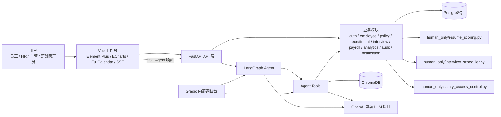

# TalentFlow 智聘中枢架构说明

## 架构目标与边界

TalentFlow 智聘中枢是面向企业人力资源管理场景的本地部署 Web 企业管理平台。正式形态是前后端分离的企业 SaaS 工作台，服务 HR、部门主管、薪酬管理员和普通员工。

系统边界：

- 正式主界面使用 Vue 3 工作台，不使用 Gradio 承担正式业务入口。
- 后端采用 FastAPI 模块化单体，不拆分微服务。
- Agent 使用 LangGraph 编排多工具和跨模块任务。
- RAG 使用 ChromaDB 检索企业制度知识库，并展示回答来源。
- PostgreSQL 保存业务数据。
- Gradio 仅用于内部 Agent 调试和备用演示。
- 不使用 SpringBoot、Redis、Celery、RabbitMQ、Kubernetes。

## 技术组合原因

- Vue 3 + TypeScript + Vite 适合构建正式企业工作台，便于模块化页面、权限控制和复杂交互。
- FastAPI + Python 与 LangGraph、LangChain Tools、ChromaDB 和 OpenAI 兼容模型接口集成成本低。
- 模块化单体适合 4 人、12 天项目周期，部署简单、调试简单、模块边界清晰。
- PostgreSQL 适合保存员工、候选人、岗位、流程、薪资权限、审计日志等结构化业务数据。
- ChromaDB 适合制度知识库向量检索、RAG 命中来源追踪和本地部署。
- Gradio 能快速查看 LangGraph 执行链、工具调用、RAG 命中内容和错误信息，但不适合作为正式企业管理主界面。

## 总体架构图



## 前端工作台结构

正式前端为企业 SaaS 工作台风格：

- `AppShell`：全局壳层，组织侧边栏、顶部栏、业务区和底部 Agent 指令栏。
- `AppSidebar`：左侧模块导航栏。
- `AppTopbar`：顶部全局搜索、通知、主题切换、头像与角色切换。
- `RouterView`：中间当前业务模块工作区。
- `GlobalAgentBar`：底部全局 Agent 指令栏，支持自然语言任务输入和 SSE 响应展示。

## 前端功能模块

- 招聘看板
- 岗位
- 候选人
- 招聘流程
- 面试排期
- 员工服务
- 制度中心
- 薪资
- 分析报表
- 审计
- 通知

重点页面包括智能招聘看板、候选人评分与对比、招聘流程看板、面试日历、员工自助服务、薪资权限与审计、招聘数据驾驶舱。

## 后端模块边界

- `auth`：登录、角色、权限上下文。
- `employee`：员工档案、员工自助服务基础数据。
- `policy`：企业制度、制度分类、制度来源。
- `recruitment`：岗位、岗位画像、简历解析、候选人、候选人对比、招聘流程。
- `interview`：面试官、会议室、时间槽、排期建议、冲突说明。
- `payroll`：薪资查询、薪资可见范围、敏感访问入口。
- `analytics`：招聘漏斗、技能缺口、面试官负载、排期风险、智能报告。
- `audit`：敏感访问日志、Agent 操作日志、权限审计。
- `notification`：站内通知、任务提醒。
- `agents`：LangGraph 流程、Agent 状态和执行链记录。
- `tools`：Agent 可调用工具，封装业务能力。
- `rag`：ChromaDB 检索、制度来源追踪、RAG 上下文构建。
- `human_only`：人工手写核心算法禁飞区。

## 请求流

### 普通页面操作

```text
Vue -> FastAPI API -> Service -> Repository / Database
```

适用场景：列表查询、表单提交、状态更新、普通 CRUD、确定性筛选。

### Agent 任务

```text
Vue -> FastAPI API -> LangGraph Agent -> Tool -> Service -> Database 或 human_only
```

适用场景：自然语言任务、多工具编排、跨模块任务，例如员工制度问答、岗位画像生成、招聘建议、候选人分析。

### RAG 问答

```text
Agent -> Policy Tool -> ChromaDB -> LLM -> 带来源的回答
```

回答必须展示制度依据，包含命中的制度片段、来源名称或来源标识。

## AI 禁飞区调用关系

禁飞区只包含以下三个文件：

- `backend/app/human_only/resume_scoring.py`：简历多维加权评分。
- `backend/app/human_only/interview_scheduler.py`：面试排期约束满足。
- `backend/app/human_only/salary_access_control.py`：薪资查询权限校验。

调用链要求：

```text
Agent -> Tool -> Service -> human_only
API -> Service -> human_only
```

禁止调用方式：

```text
Agent -> human_only
Tool -> human_only
前端 -> human_only
```

禁飞区只接收结构化输入，只输出结构化结果，不直接依赖 FastAPI、SQLAlchemy、LangGraph、ChromaDB、HTTP 请求、数据库连接或大模型接口。

## 人写核心算法，AI 辅助外围工程

- 人工手写：简历多维加权评分、面试排期约束满足、薪资查询权限校验。
- AI 可辅助：页面、接口、Service 编排、Repository、Agent Tool、测试骨架、文档草稿。
- AI 不得生成或修改禁飞区核心算法实现。
- Agent 只能通过 Service 使用禁飞区结果，不能绕过权限或直接调用内部实现。

## Gradio 定位

Gradio 仅用于内部 Agent 调试和备用演示，主要查看：

- LangGraph 执行链。
- Agent 工具调用过程。
- RAG 命中内容。
- LLM 输入输出摘要。
- 错误信息。

Gradio 不作为正式业务入口，不替代 Vue 工作台，不承载正式权限交互和业务流程。

## 不采用微服务的原因

项目团队规模为 4 人，周期为 12 天。微服务会引入服务拆分、服务发现、跨服务鉴权、链路追踪、部署编排和数据一致性成本。当前阶段优先选择模块化单体，在一个 FastAPI 应用内保持清晰模块边界，以降低部署和调试风险。
