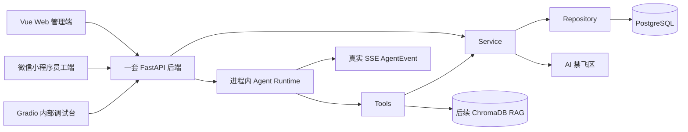

# TalentFlow 智聘中枢

TalentFlow 智聘中枢是面向招聘决策、员工服务、考勤薪资预审与权限审计的可解释企业人力资源管理 Agent。

## 当前状态

当前状态：Sprint 1 确定性业务闭环已存在，Sprint 2.1 已接入第一个可运行切片：进程内 Agent Run、招聘策略 Agent 规则式执行计划、真实 SSE 事件和前端实时流程看板。Run 在后端重启后会丢失。

数据库层当前已建立 SQLAlchemy ORM 模型、Alembic 配置和首次迁移文件 `0001_initial_schema`。该迁移尚未执行，仓库当前不包含种子数据或已验证的部署结果。

## 项目定位

TalentFlow 通过一套 FastAPI 后端支撑 Vue Web 管理端、微信小程序员工端和 Gradio 内部调试台。系统围绕招聘决策、员工服务、考勤事实、薪资预审、权限审计和 Agent Trace 建设，强调可解释、可追溯和权限隔离。

## 核心能力

- 招聘决策：岗位画像、候选人评分、权重沙盘、候选人比较、招聘流程和面试排期。
- 员工服务：年假、制度、本人薪资摘要和员工服务 Agent。
- 考勤：员工签到、签退、今日考勤状态和本月考勤摘要。
- 薪资预审：HR 查看预审明细、扣款来源、异常解释和待 HR 确认状态。
- 权限审计：薪资访问控制、字段脱敏、敏感访问日志和 `trace_id`。
- Agent 能力：当前只运行招聘策略 Agent；简历解析、岗位匹配、面试评估、决策审查和 HR 最终报告已建立数据、节点、Tool 与 Prompt 契约，但尚未执行。员工服务 Agent、薪资预审助手与 RAG 同样只有契约，尚未接入真实执行。

## 端与边界

- Vue Web 管理端：HR 招聘、排期、薪资预审、审计、驾驶舱，以及员工相关查询入口。
- 微信小程序员工端：Sprint 3 规划中的员工端入口，仅提供签到、签退、考勤摘要、年假余额、本人薪资摘要和制度查询。
- Gradio：仅作为内部 Agent 调试台，不作为正式业务入口。
- Web、小程序和 Gradio 共享同一套 FastAPI 后端。

## AI 禁飞区

以下三个核心算法文件及其核心测试由人工负责人编写，AI 不得创建或修改：

- `backend/app/human_only/resume_scoring.py`
- `backend/app/human_only/interview_scheduler.py`
- `backend/app/human_only/salary_access_control.py`

核心测试文件：

- `backend/tests/human_only/test_resume_scoring.py`
- `backend/tests/human_only/test_interview_scheduler.py`
- `backend/tests/human_only/test_salary_access_control.py`

工程调用链必须分离：

- 普通请求：`API -> Service -> Repository -> PostgreSQL`。
- Agent 任务：`Agent -> Tool -> Service -> human_only`。

## 技术栈

| 技术                        | 用途                  |
| --------------------------- | --------------------- |
| Vue 3 + TypeScript + Vite   | Web 管理端            |
| FastAPI + Python 3.12       | 一套共享后端          |
| PostgreSQL                  | 结构化业务数据        |
| 规则式异步 Runtime + SSE    | Sprint 2.1 招聘策略运行与实时事件 |
| LangGraph + LangChain Tools | 后续 Agent 编排规划   |
| ChromaDB                    | 后续企业制度 RAG 规划 |
| Gradio                      | 内部 Agent 调试台     |
| Docker Compose + Nginx      | Sprint 3 计划部署目标 |

## 系统架构



## 招聘多 Agent 正式架构

```text
企业招聘目标
→ 招聘策略 Agent
→ 简历解析 Agent / 岗位匹配 Agent / 面试评估 Agent
→ 决策审查 Agent
→ HR 最终报告
→ HR 人工决定
```

| 状态 | 范围 |
| --- | --- |
| 已实现 | 招聘策略规则式计划、进程内 RunStore、真实 `run_id`/`trace_id`、SSE 与前端实时看板 |
| 已建立契约 | 六节点静态图、候选人/证据/审查/报告类型、Tool/Service Protocol、RAG Schema/Protocol |
| 后续规划 | LangGraph、LLM、真实 RAG/ChromaDB、员工服务 Agent、薪资预审助手及其余五个招聘节点执行 |

岗位匹配依赖简历解析，面试评估只能使用真实结构化面试数据。Agent 通过 Tool 调用 Service，不直接访问 Repository 或 `human_only`；Agent 不自动录用、淘汰、确认排期或确认薪资，最终决定由 HR 完成。

## 项目结构

```text
.
├── AGENTS.md
├── .agent/
├── docs/
├── backend/
│   ├── app/
│   │   ├── api/
│   │   ├── modules/
│   │   │   ├── recruitment/
│   │   │   │   ├── intelligence/     # 招聘智能分析纯数据契约
│   │   │   │   └── services/         # 真实上下文 Service 与未来专业 Service Protocol
│   │   │   └── */models.py
│   │   ├── agents/
│   │   │   ├── runtime/              # 当前进程内 Runtime 与 SSE
│   │   │   ├── shared/               # 状态、事件、来源、Guardrail、模型网关契约
│   │   │   ├── workflows/            # 招聘、员工服务、薪资预审工作流契约
│   │   │   ├── tools/                # Tool 元数据与兼容入口
│   │   │   └── prompts/              # Prompt 边界说明
│   │   ├── rag/
│   │   │   ├── ingestion/            # 摄取 Protocol，未接入真实索引
│   │   │   └── retrieval/            # 检索与引用 Protocol，未接入真实检索
│   │   ├── shared/
│   │   ├── human_only/
│   │   └── agent_console/
│   ├── alembic/
│   │   └── versions/
│   └── tests/
├── frontend/
├── miniprogram/
├── data/
├── infra/
└── scripts/
```

## 开发规范

- 只使用 `dev` 和 `main`。
- 禁止直接向 `main` 提交。
- Commit 类型使用 `feat`、`fix`、`docs`、`refactor`。
- 修改架构、需求、接口、数据模型、权限或薪资规则时同步更新 docs 与 `.agent`。
- 遵守根目录与各子目录分层 `AGENTS.md` 约束。
- 不提交真实 `.env`、真实密钥、真实企业数据和本地运行产物。

## 计划运行方式

当前命令仅作为计划运行方式，需待对应脚手架和配置完成后使用。

```powershell
conda activate talentflow
pip install -r backend/requirements-dev.txt

cd frontend
npm install
npm run dev
```

后端计划端口：`8000`。前端计划端口：`5173`。小程序局域网调试需使用笔记本局域网 IP，不使用 `localhost`。

数据库迁移计划由团队成员在本地后端目录手动执行：

```powershell
cd "你的本地后端文件路径"
alembic upgrade head
```
