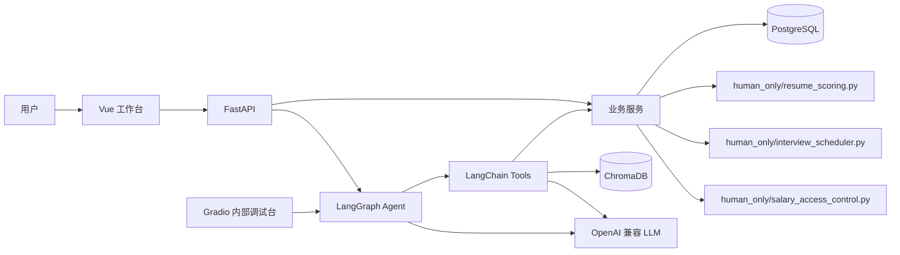

<<<<<<< HEAD
# TalentFlow智聘


## Getting started

To make it easy for you to get started with GitLab, here's a list of recommended next steps.

Already a pro? Just edit this README.md and make it your own. Want to make it easy? [Use the template at the bottom](#editing-this-readme)!

## Add your files

- [ ] [Create](https://docs.gitlab.com/ee/user/project/repository/web_editor.html#create-a-file) or [upload](https://docs.gitlab.com/ee/user/project/repository/web_editor.html#upload-a-file) files
- [ ] [Add files using the command line](https://docs.gitlab.com/topics/git/add_files/#add-files-to-a-git-repository) or push an existing Git repository with the following command:

```
cd existing_repo
git remote add origin http://csgitlab.whu.edu.cn/2025-2026-3-advancedprograming/2024-se-15-talentflow/talentflow.git
git branch -M main
git push -uf origin main
```

## Integrate with your tools

- [ ] [Set up project integrations](http://csgitlab.whu.edu.cn/2025-2026-3-advancedprograming/2024-se-15-talentflow/talentflow/-/settings/integrations)

## Collaborate with your team

- [ ] [Invite team members and collaborators](https://docs.gitlab.com/ee/user/project/members/)
- [ ] [Create a new merge request](https://docs.gitlab.com/ee/user/project/merge_requests/creating_merge_requests.html)
- [ ] [Automatically close issues from merge requests](https://docs.gitlab.com/ee/user/project/issues/managing_issues.html#closing-issues-automatically)
- [ ] [Enable merge request approvals](https://docs.gitlab.com/ee/user/project/merge_requests/approvals/)
- [ ] [Set auto-merge](https://docs.gitlab.com/user/project/merge_requests/auto_merge/)

## Test and Deploy

Use the built-in continuous integration in GitLab.

- [ ] [Get started with GitLab CI/CD](https://docs.gitlab.com/ee/ci/quick_start/)
- [ ] [Analyze your code for known vulnerabilities with Static Application Security Testing (SAST)](https://docs.gitlab.com/ee/user/application_security/sast/)
- [ ] [Deploy to Kubernetes, Amazon EC2, or Amazon ECS using Auto Deploy](https://docs.gitlab.com/ee/topics/autodevops/requirements.html)
- [ ] [Use pull-based deployments for improved Kubernetes management](https://docs.gitlab.com/ee/user/clusters/agent/)
- [ ] [Set up protected environments](https://docs.gitlab.com/ee/ci/environments/protected_environments.html)

***

# Editing this README

When you're ready to make this README your own, just edit this file and use the handy template below (or feel free to structure it however you want - this is just a starting point!). Thanks to [makeareadme.com](https://www.makeareadme.com/) for this template.

## Suggestions for a good README

Every project is different, so consider which of these sections apply to yours. The sections used in the template are suggestions for most open source projects. Also keep in mind that while a README can be too long and detailed, too long is better than too short. If you think your README is too long, consider utilizing another form of documentation rather than cutting out information.

## Name
Choose a self-explaining name for your project.

## Description
Let people know what your project can do specifically. Provide context and add a link to any reference visitors might be unfamiliar with. A list of Features or a Background subsection can also be added here. If there are alternatives to your project, this is a good place to list differentiating factors.

## Badges
On some READMEs, you may see small images that convey metadata, such as whether or not all the tests are passing for the project. You can use Shields to add some to your README. Many services also have instructions for adding a badge.

## Visuals
Depending on what you are making, it can be a good idea to include screenshots or even a video (you'll frequently see GIFs rather than actual videos). Tools like ttygif can help, but check out Asciinema for a more sophisticated method.

## Installation
Within a particular ecosystem, there may be a common way of installing things, such as using Yarn, NuGet, or Homebrew. However, consider the possibility that whoever is reading your README is a novice and would like more guidance. Listing specific steps helps remove ambiguity and gets people to using your project as quickly as possible. If it only runs in a specific context like a particular programming language version or operating system or has dependencies that have to be installed manually, also add a Requirements subsection.

## Usage
Use examples liberally, and show the expected output if you can. It's helpful to have inline the smallest example of usage that you can demonstrate, while providing links to more sophisticated examples if they are too long to reasonably include in the README.

## Support
Tell people where they can go to for help. It can be any combination of an issue tracker, a chat room, an email address, etc.

## Roadmap
If you have ideas for releases in the future, it is a good idea to list them in the README.

## Contributing
State if you are open to contributions and what your requirements are for accepting them.

For people who want to make changes to your project, it's helpful to have some documentation on how to get started. Perhaps there is a script that they should run or some environment variables that they need to set. Make these steps explicit. These instructions could also be useful to your future self.

You can also document commands to lint the code or run tests. These steps help to ensure high code quality and reduce the likelihood that the changes inadvertently break something. Having instructions for running tests is especially helpful if it requires external setup, such as starting a Selenium server for testing in a browser.

## Authors and acknowledgment
Show your appreciation to those who have contributed to the project.

## License
For open source projects, say how it is licensed.

## Project status
If you have run out of energy or time for your project, put a note at the top of the README saying that development has slowed down or stopped completely. Someone may choose to fork your project or volunteer to step in as a maintainer or owner, allowing your project to keep going. You can also make an explicit request for maintainers.
=======
# TalentFlow 智聘中枢

TalentFlow 智聘中枢是一个面向招聘决策、员工服务与权限审计的可解释企业人力资源管理 Agent。

## 项目背景

企业 HR 工作中，岗位需求、候选人信息、面试排期资源、员工制度和薪资权限数据通常分散在不同系统或文档中，导致招聘决策不透明、员工服务响应慢、权限审计难追踪。

TalentFlow 通过 Agent 编排员工服务、候选人筛选、面试排期、招聘报告与风险洞察等任务，并在关键结果中展示依据、来源和工具调用过程。系统定位不是“普通 HR 系统加聊天框”，而是让 Agent 参与核心人力资源业务流程。

## 核心能力

- 员工自助服务 Agent：支持假期、本人薪资和公司制度查询。
- 智能招聘决策：辅助岗位画像、候选人筛选和招聘建议生成。
- 可解释候选人评分：展示评分维度、权重和候选人差距。
- 智能面试排期：结合候选人、面试官、会议室和时间槽生成推荐方案。
- 薪资权限与审计：按角色和字段控制薪资可见范围，记录敏感访问。
- 招聘驾驶舱与报告：展示招聘漏斗、技能缺口、面试官负载和排期风险。

## 项目功能

### 员工端

- 多角色登录：普通员工、HR 专员、部门主管、薪酬管理员。
- 员工服务 Agent：查询假期、本人薪资和公司制度。
- 制度问答：展示制度依据、来源片段和 Agent 工具调用过程。
- 员工自助服务：围绕个人信息、制度咨询和薪资可见范围提供查询入口。

### HR 端

- 岗位创建与岗位画像：HR 输入岗位描述，Agent 输出结构化岗位要求。
- 简历导入、候选人档案与智能筛选。
- 招聘权重沙盘：调整技能、项目、到岗时间等权重后，候选人排名和解释实时变化。
- 候选人多维对比：对比技能、项目、到岗时间、岗位缺口和综合评分。
- 招聘流程看板：管理投递、初筛、约面、面试、Offer、入职或淘汰等阶段流转。
- 智能面试排期：生成推荐排期，并说明冲突原因。

### 管理与安全

- 公司制度知识库：支持请假、报销、薪资保密、试用期、招聘等制度检索。
- 薪资权限控制：按角色、访问对象和字段级别控制薪资可见范围。
- 敏感访问审计：记录薪资、候选人评分和 Agent 操作等关键访问日志。
- 通知与提醒：支持流程状态、面试安排和待办事项通知。

### Agent 能力

- LangGraph 编排员工服务 Agent 与招聘决策 Agent。
- LangChain Tools 封装业务能力、RAG 检索和核心算法调用入口。
- RAG 问答返回制度来源，不只返回结论。
- Gradio 内部调试台用于查看 LangGraph 流程、工具调用、RAG 检索结果和 Agent 错误信息。

## AI 禁飞区

以下三个核心模块必须由人工手写，不得由 AI 生成实现代码：

- `backend/app/human_only/resume_scoring.py`
  - 解决简历多维加权评分问题，用于候选人排序、解释和对比。
- `backend/app/human_only/interview_scheduler.py`
  - 解决面试排期约束满足问题，用于候选人、面试官、会议室和时间槽匹配。
- `backend/app/human_only/salary_access_control.py`
  - 解决薪资查询权限校验问题，用于判断不同角色、访问对象和字段的可见范围。

AI 只可辅助生成禁飞区之外的页面、接口、Service 编排、Agent Tool、测试骨架和文档草稿。Agent 调用核心算法必须走 `Tool -> Service -> human_only` 链路，不能绕过权限或直接访问禁飞区内部实现。

## 技术栈

| 技术 | 项目用途 |
| --- | --- |
| Vue 3 + TypeScript + Vite | 构建正式企业 SaaS 工作台前端。 |
| Element Plus | 提供表单、表格、弹窗、导航等企业管理界面组件。 |
| ECharts | 展示招聘漏斗、技能缺口、面试官负载和数据驾驶舱图表。 |
| FullCalendar | 展示和管理面试日历、时间槽和排期结果。 |
| FastAPI | 提供后端 API、业务编排入口和 Agent 调用入口。 |
| LangGraph | 编排员工服务 Agent 与招聘决策 Agent 的执行流程。 |
| PostgreSQL | 保存员工、岗位、候选人、流程、薪资权限和审计等结构化数据。 |
| ChromaDB | 建立企业制度知识库，支持 RAG 检索和来源展示。 |
| Gradio | 作为内部 Agent 调试台，不作为正式主界面。 |
| Docker Compose + Nginx | 作为本地部署和正式演示的目标方案。 |

## 系统架构



普通页面操作走 `Vue -> FastAPI -> Service -> Repository / Database`。自然语言、多工具和跨模块任务走 `Vue -> FastAPI -> LangGraph Agent -> Tool -> Service`。制度问答通过 ChromaDB 检索，并由 LLM 生成带来源的回答。

## 项目结构

```text
.
├── .agent/                    # 项目协作规范、架构说明和技术决策记录
├── docs/                      # 项目文档与报告
├── frontend/                  # Vue 3 + TypeScript + Vite 正式前端
├── backend/                   # FastAPI 后端模块化单体
│   └── app/
│       ├── agents/            # LangGraph Agent 编排
│       ├── rag/               # ChromaDB RAG 检索与来源组织
│       └── human_only/        # AI 禁飞区核心算法
├── data/                      # 演示数据、制度知识库原始资料或导入数据
├── infra/                     # Nginx、部署和基础设施配置
├── scripts/                   # 开发、数据初始化和辅助脚本
├── docker-compose.yml         # 计划中的本地部署编排文件
└── README.md
```

## 开发规范

- 分支策略：`main` 为稳定分支，`dev` 为开发主线，`feature/*` 为功能分支。
- Commit 类型：仅使用 `feat`、`fix`、`docs`、`refactor`。
- 禁止直接向 `main` 提交代码。
- 提交和合并需要关联 Issue。
- 修改架构、技术方案或禁飞区边界时，需要同步更新 `.agent/architecture.md` 或 `.agent/decisions.md`。

## 计划运行方式

当前项目处于开发中，以下为计划运行方式。命令示例需待项目脚手架和 Docker 配置完成后使用，不能视为当前已经验证可运行。

预期会通过 Docker Compose 启动 PostgreSQL、后端和前端：

```bash
# 待项目脚手架和 Docker 配置完成后使用
docker compose up --build
```

预期访问方式：

- 通过浏览器访问正式 Vue 工作台。
- 通过 FastAPI `/docs` 查看接口文档。
- 通过内部 Gradio 页面调试 Agent 流程、工具调用和 RAG 检索结果。

## 团队协作

- 项目由 4 人协作完成。
- 采用 Scrum Sprint 推进需求拆分、开发、评审和验收。
- 每位成员负责明确模块，减少职责重叠和交付遗漏。
- PO、SM、QA 角色按团队创建报告确定。
- 核心算法负责人需独立完成并能解释对应 AI 禁飞区代码。

## 当前状态

- 当前状态：开发中。
- 项目处于初始化与 Sprint 1 规划阶段。
- 当前优先事项是完成工程脚手架、数据模型、接口契约、演示数据与三个禁飞区的设计。
- 功能与部署说明将随 Sprint 推进更新。
- README 会随开发进度持续更新。
>>>>>>> 2f6edfb08c8594d3044639dc75bfc1e617347faa
