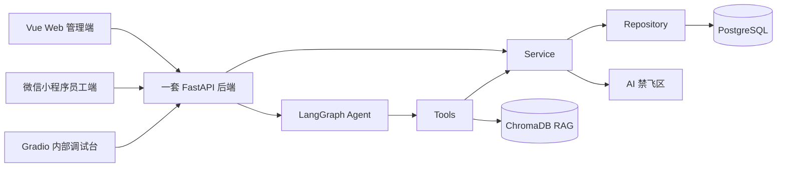

# TalentFlow 智聘中枢

TalentFlow 智聘中枢是面向招聘决策、员工服务、考勤薪资预审与权限审计的可解释企业人力资源管理 Agent。

## 当前状态

当前状态：开发中。功能、部署、测试与接口说明将随 Sprint 推进持续更新。

## 项目定位

TalentFlow 通过一套 FastAPI 后端支撑 Vue Web 管理端、微信小程序员工端和 Gradio 内部调试台。系统围绕招聘决策、员工服务、考勤事实、薪资预审、权限审计和 Agent Trace 建设，强调可解释、可追溯和权限隔离。

## 核心能力

- 招聘决策：岗位画像、候选人评分、权重沙盘、候选人比较、招聘流程和面试排期。
- 员工服务：年假、制度、本人薪资摘要和员工服务 Agent。
- 考勤：员工签到、签退、今日考勤状态和本月考勤摘要。
- 薪资预审：HR 查看预审明细、扣款来源、异常解释和待 HR 确认状态。
- 权限审计：薪资访问控制、字段脱敏、敏感访问日志和 `trace_id`。
- Agent 能力：员工服务 Agent、招聘决策 Agent、薪资预审助手、RAG 来源展示。

## 端与边界

- Vue Web 管理端：HR 招聘、排期、薪资预审、审计、驾驶舱，以及员工相关查询入口。
- 微信小程序员工端：Sprint 3 规划中的员工端入口，仅提供签到、签退、考勤摘要、年假余额、本人薪资摘要和制度查询。
- Gradio：仅作为内部 Agent 调试台，不作为正式业务入口。
- Web、小程序和 Gradio 共享同一套 FastAPI 后端。

## AI 禁飞区

以下三个核心算法文件及其核心测试由人工负责人编写，AI 不得创建或修改：

- `backend/app/human_only/resume_scoring.py`
- `backend/app/human_only/interview_scheduler.py`
- `backend/app/human_only/salary_access_control.py`

核心测试文件：

- `backend/tests/human_only/test_resume_scoring.py`
- `backend/tests/human_only/test_interview_scheduler.py`
- `backend/tests/human_only/test_salary_access_control.py`

工程调用链必须分离：

- 普通请求：`API -> Service -> Repository -> PostgreSQL`。
- Agent 任务：`Agent -> Tool -> Service -> human_only`。

## 技术栈

| 技术 | 用途 |
| --- | --- |
| Vue 3 + TypeScript + Vite | Web 管理端 |
| FastAPI + Python 3.12 | 一套共享后端 |
| PostgreSQL | 结构化业务数据 |
| LangGraph + LangChain Tools | Agent 编排与工具调用 |
| ChromaDB | 企业制度 RAG 检索 |
| Gradio | 内部 Agent 调试台 |
| Docker Compose + Nginx | Sprint 3 计划部署目标 |

## 系统架构



## 项目结构

```text
.
├── AGENTS.md
├── .agent/
├── docs/
├── backend/
│   ├── app/
│   │   ├── api/
│   │   ├── modules/
│   │   ├── agents/
│   │   ├── rag/
│   │   ├── shared/
│   │   ├── human_only/
│   │   └── agent_console/
│   └── tests/
├── frontend/
├── miniprogram/
├── data/
├── infra/
└── scripts/
```

## 开发规范

- 只使用 `dev` 和 `main`。
- 禁止直接向 `main` 提交。
- Commit 类型使用 `feat`、`fix`、`docs`、`refactor`。
- 修改架构、需求、接口、数据模型、权限或薪资规则时同步更新 docs 与 `.agent`。
- 遵守根目录与各子目录分层 `AGENTS.md` 约束。
- 不提交真实 `.env`、真实密钥、真实企业数据和本地运行产物。

## 计划运行方式

当前命令仅作为计划运行方式，需待对应脚手架和配置完成后使用。

```powershell
conda activate talentflow
pip install -r backend/requirements-dev.txt

cd frontend
npm install
npm run dev
```

<<<<<<< HEAD
预期访问方式：

- 通过浏览器访问正式 Vue 工作台。
- 通过 FastAPI `/docs` 查看接口文档。
- 通过内部 Gradio 页面调试 Agent 流程、工具调用和 RAG 检索结果。

## 团队协作

- 项目由 4 人协作完成。
- 采用 Scrum Sprint 推进需求拆分、开发、评审和验收。
- 每位成员负责明确模块，减少职责重叠和交付遗漏。
- PO、SM、QA 角色按团队创建报告确定。
- 核心算法负责人需独立完成并能解释对应 AI 禁飞区代码。

## 当前状态

- 当前状态：开发中。
- 项目处于初始化与 Sprint 1 规划阶段。
- 当前优先事项是完成工程脚手架、数据模型、接口契约、演示数据与三个禁飞区的设计。
- 功能与部署说明将随 Sprint 推进更新。
- README 会随开发进度持续更新。
>>>>>>> 2f6edfb08c8594d3044639dc75bfc1e617347faa
=======
后端计划端口：`8000`。前端计划端口：`5173`。小程序局域网调试需使用笔记本局域网 IP，不使用 `localhost`。
>>>>>>> a42c32e758227f370de1e0076aad466524421660
