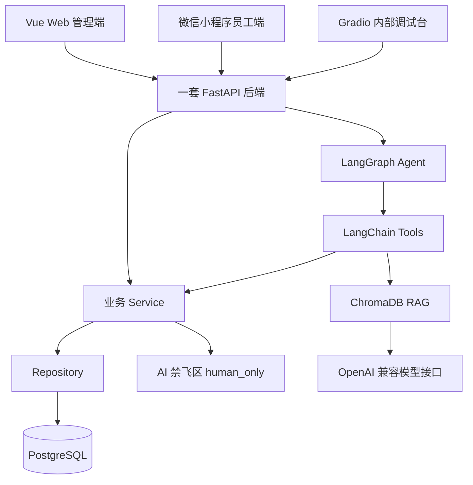

# 架构设计

## 总体原则

- 一套 FastAPI 后端。
- Vue Web 管理端、微信小程序员工端和 Gradio 内部调试台共享后端。
- 普通业务遵循 `API -> Service -> Repository -> PostgreSQL`。
- Agent 遵循 `Agent -> Tool -> Service -> human_only`。
- 后端采用模块化单体，不使用微服务，不新增第二套后端。

## 架构图

## 端边界

- Web 管理端：HR 侧招聘、排期、薪资预审、审计、驾驶舱；员工侧制度、考勤和本人薪资查询。
- 小程序员工端：只做员工简单功能，不接 HR 招聘、排期、薪资预审和审计后台。
- Gradio：只做内部 Agent 调试台。

## 考勤到薪资预审的数据流

1. 员工通过 Web 或小程序提交签到、签退。
2. 后端记录考勤事实和状态。
3. HR 查看月度考勤汇总。
4. 薪资预审读取考勤事实和月度汇总。
5. 规则引擎生成薪资预审和扣款明细。
6. HR 查看解释、审查异常并最终确认。
7. 敏感查询、预审、确认和拒绝动作写入审计并保留 `trace_id`。

## 数据库与迁移边界

- ORM 模型集中在 `backend/app/modules/*/models.py`。
- `backend/app/core/database.py` 只提供 `Base`、通用时间戳、引擎和会话工厂。
- `backend/app/modules/model_registry.py` 仅用于集中导入模型模块，供 Alembic 发现元数据。
- Alembic 首次迁移为 `0001_initial_schema`，只创建结构，不写入种子数据。
- Sprint 1 已补充基础 FastAPI 平台、统一响应、异常处理、演示身份上下文、部分 Service/Repository 和只读 API 对接。
- Agent、RAG 和 Gradio 业务流程在 Sprint 1 只保留后续接入位置，不实现真实业务编排。

## Sprint 1 平台接口边界

- Route 只负责请求参数、依赖注入、统一响应封装和调用 Service。
- Service 负责演示身份、权限入口、跨模块业务含义和错误返回。
- Repository 只负责 SQLAlchemy 查询。
- `scripts/build-demo-data.py` 提供演示数据重建入口，种子数据与 Alembic 结构迁移分离。
- 薪资查询 Service 只通过 `PayrollAccessService` 尝试调用人工禁飞区公开函数 `check_salary_access(...)`；函数不存在时统一拒绝，不复制、不模拟权限算法。

## 薪资预审与确认分离

- 规则引擎负责计算预审结果。
- AI 只解释、总结和提示异常。
- HR 才能确认薪资。
- 所有敏感查询、预审、确认和拒绝都必须写入审计日志。

## 局域网运行

FastAPI 后端计划运行在笔记本局域网地址上。Web 可以使用 `localhost` 调试；小程序不能使用 `localhost`，需要配置笔记本局域网 IP。
