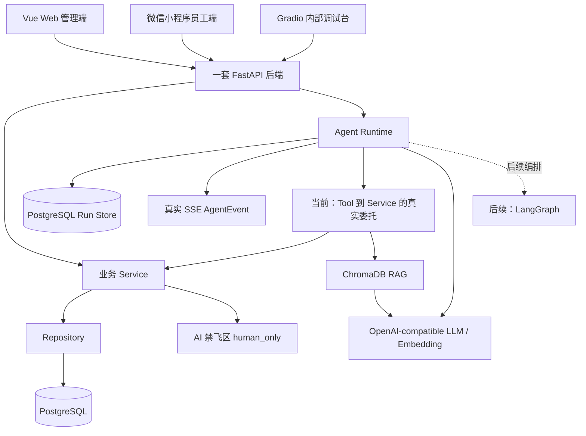
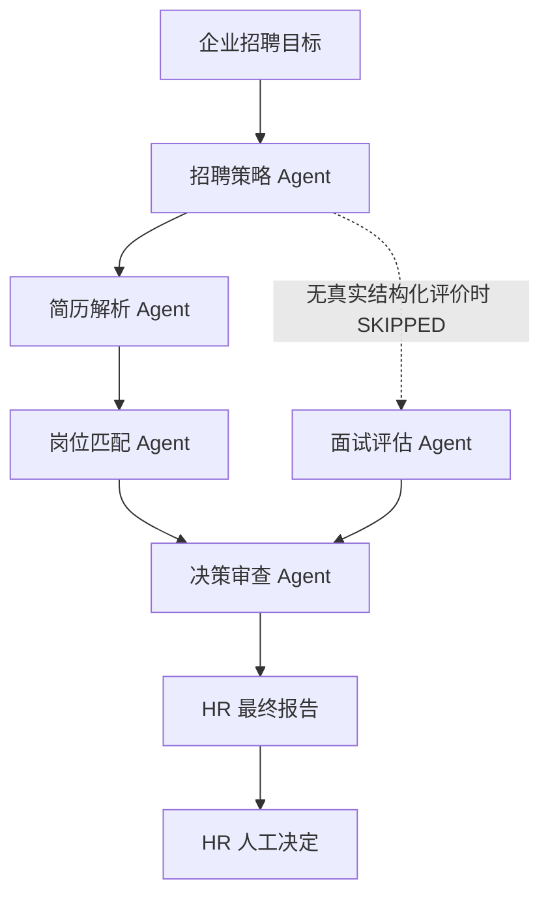
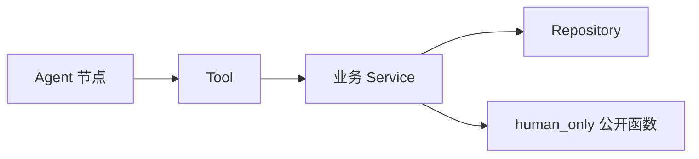
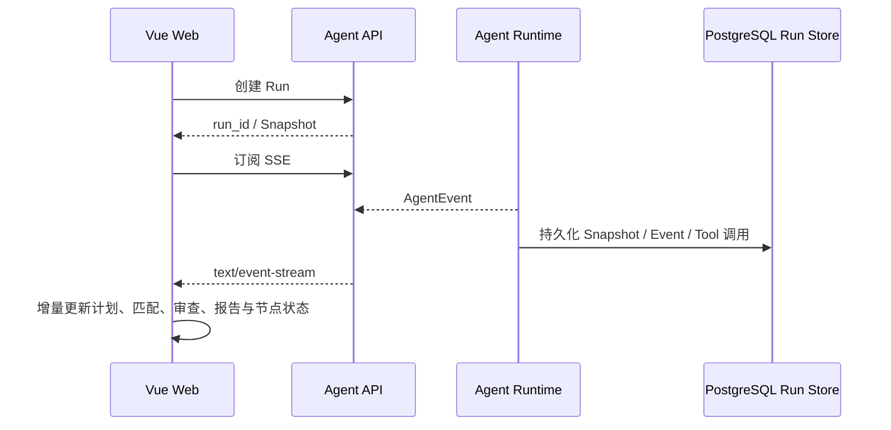

# 架构设计

## 总体原则

- 一套 FastAPI 后端。
- Vue Web 管理端和微信小程序员工端共享后端。
- 普通业务请求遵循 `API -> Service -> Repository -> PostgreSQL`。
- 普通业务调用核心算法遵循 `API -> Service -> human_only`。
- Agent 任务调用核心算法遵循 `Agent -> Tool -> Service -> human_only`。
- 后端模块化。

## 架构图

## 端边界

- Web 管理端：HR 侧招聘、排期、薪资预审、审计、驾驶舱；员工侧制度、考勤和本人薪资查询。
- 小程序员工端：只做员工简单功能，不接 HR 招聘、排期、薪资预审和审计后台。

## Agent 架构

- `agents/runtime/`：当前 RunStore、Runner 与 SSE。
- `agents/shared/`：事件、状态、来源、Guardrail 与模型网关契约。
- `agents/workflows/`：招聘、员工服务、薪资预审的工作流契约。
- `agents/tools/`：Tool Contract 与真实 Service 委托；新 Agent 代码只能经 Tool 调用 Service。
- `rag/`：摄取、检索、引用与向量存储 Protocol；未接入真实 ChromaDB，也未建立真实本地知识库。企业知识回退位于招聘 Service，以 `LOCAL_HYBRID_FALLBACK` 标识，不冒充 RAG 索引或命中。
- `modules/recruitment/intelligence/`：事实提取、技能标准化、证据、Rubric 与可信度契约。
- `modules/recruitment/services/`：Run 上下文、企业知识本地混合回退、确定性候选人画像、岗位匹配、规则式决策审查与结构化报告 Service。

### 招聘六节点架构与 Sprint 2.3 执行范围

当前阶段为 `SPRINT_2_3_INTEGRATED`，执行招聘策略、简历解析、岗位匹配、决策审查和 HR 最终报告，下一阶段为 `END_TO_END_VALIDATION`。面试评估只能读取真实结构化面试数据，无数据时以 `STRUCTURED_INTERVIEW_FEEDBACK_NOT_AVAILABLE` 标记为 `SKIPPED`；决策审查仍继续运行并记录面试数据缺失。模型不得修改确定性评分或排序，最终报告不拥有录用、淘汰、排期确认或薪资确认权，最终决定由 HR 完成。相关代码存在，待本地人工验收。

### Agent 调用边界

Agent 不访问 Repository 或 `human_only`；Tool 只调用 Service。普通 Route 仍遵循正常的 `API -> Service` 分层。

岗位匹配 Service 通过既有 bridge 调用人工维护的确定性评分算法；算法不可用时返回无分且需要人工复核，不生成替代分数。决策审查与 HR 报告使用明确规则和结构化汇总，不访问 Repository、不写回 Agent Run 评分结果到数据库。

### 实时事件链

Sprint 2.3 继续使用既有三个 Run API、JWT、`agent.hr.use`、Run 所有者隔离和 SSE 裸 `AgentEvent`。容器注入 PostgreSQL Store，Runtime 只依赖 Store Protocol，不直接访问 Repository 或 `human_only`；SSE Queue 留在内存，历史事件从数据库按 `sequence_no` 重放。代码存在，待本地人工验收。

OpenAI-compatible Chat/Embedding Client、ChromaDB Persistent Collection 和本地演示知识摄取代码存在，待本地人工验收。配置禁用或调用失败时分别回退到确定性叙述和 `LOCAL_HYBRID_FALLBACK`，不虚构模型输出或 RAG 命中。

## LLM/RAG 集成前置边界

- `ApplicationContainer` 负责组装 ModelGateway、RetrievalGateway、知识库生命周期、招聘知识 Service 与 Runner 依赖，不保存数据库 Session 或 Repository。
- ModelGateway 与 RetrievalGateway 使用异步契约；状态使用 `DISABLED`、`MISCONFIGURED`、`READY` 或 `DEGRADED`，不得把回退伪装成 READY。
- 招聘知识调用保持 `Agent -> Tool -> Service`。Service 优先调用 RetrievalGateway，真实检索不可用或来源无法映射为招聘领域结构时，明确回退到独立的 `LOCAL_HYBRID_FALLBACK`。
- FastAPI lifespan 只管理可选集成的初始化与释放；可选 LLM/RAG 未配置或不可用不得阻塞确定性业务启动。
- `/health` 只暴露安全的集成模式、Provider/模型标识和 Collection 状态，不返回密钥、连接串、绝对路径、堆栈或伪造的文档数量。

## 数据库与迁移边界

- ORM 模型集中在 `backend/app/modules/*/models.py`。
- `backend/app/core/database.py` 只提供 `Base`、通用时间戳、引擎和会话工厂。
- `backend/app/modules/model_registry.py` 仅用于集中导入模型模块，供 Alembic 发现元数据。
- Alembic 首次迁移为 `0001_initial_schema`，只创建结构，不写入种子数据。
- 数据库基线只负责结构；业务 API、Service、Repository 需要按模块逐步补齐。

# 规则引擎负责计算预审结果。

- AI 只解释、总结和提示异常。
- HR 才能确认薪资。
- 所有敏感查询、预审、确认和拒绝都必须写入审计日志。

## 局域网运行

FastAPI 后端计划运行在笔记本局域网地址上。Web 可以使用 `localhost` 调试；小程序不能使用 `localhost`，需要配置笔记本局域网 IP。
