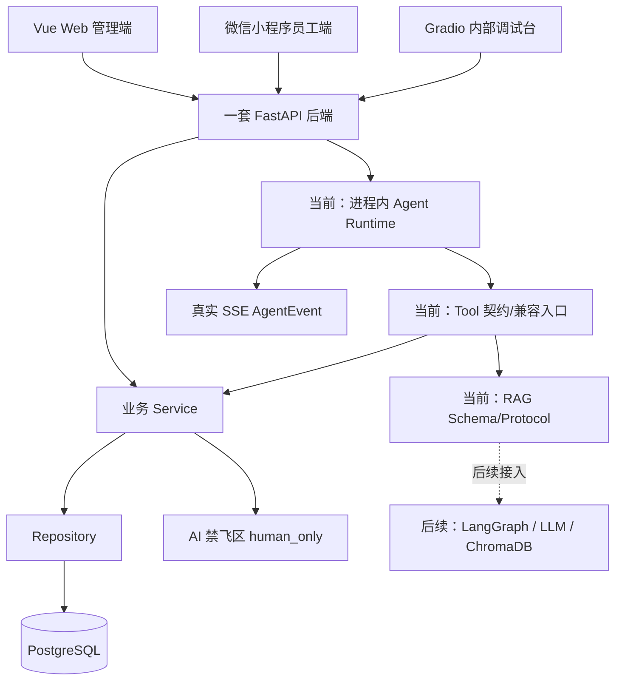
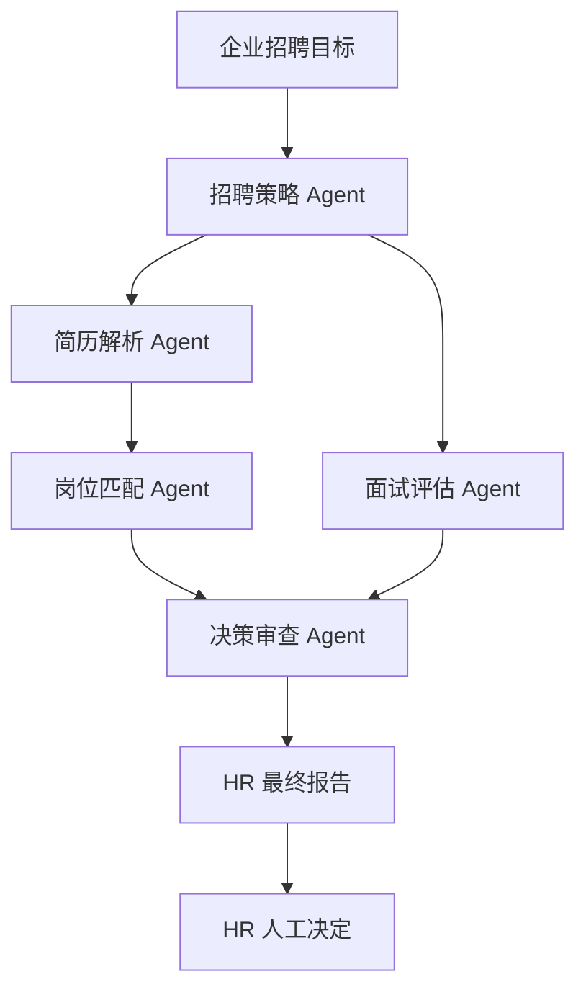
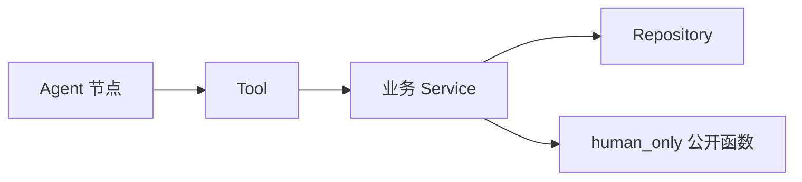
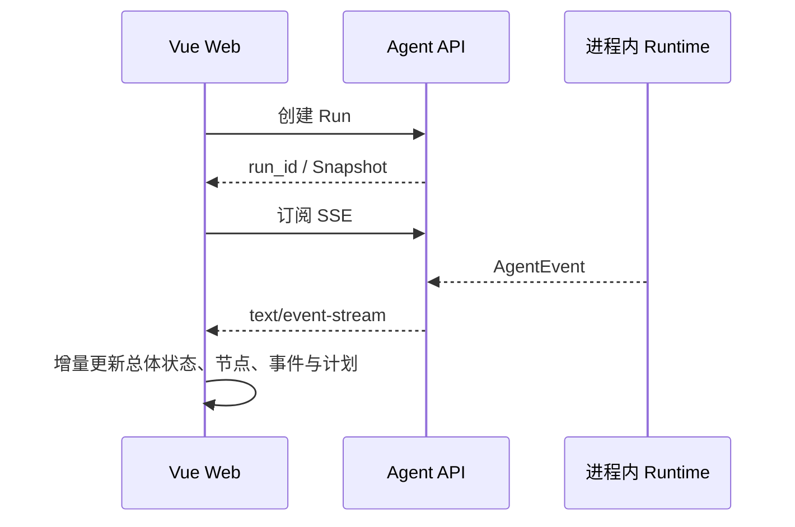

# 架构设计

## 总体原则

- 一套 FastAPI 后端。
- Vue Web 管理端、微信小程序员工端和 Gradio 内部调试台共享后端。
- 普通业务请求遵循 `API -> Service -> Repository -> PostgreSQL`。
- 普通业务调用核心算法遵循 `API -> Service -> human_only`。
- Agent 任务调用核心算法遵循 `Agent -> Tool -> Service -> human_only`。
- 后端采用模块化单体，不使用微服务，不新增第二套后端。

## 架构图

## 端边界

- Web 管理端：HR 侧招聘、排期、薪资预审、审计、驾驶舱；员工侧制度、考勤和本人薪资查询。
- 小程序员工端：只做员工简单功能，不接 HR 招聘、排期、薪资预审和审计后台。
- Gradio：只做内部 Agent 调试台。

## 当前 Agent 数据流与长期架构

Sprint 2.2 当前数据流相关代码存在，待本地人工验收：`API -> RecruitmentRunContextService -> RecruitmentService/Repository` 校验上下文并生成脱离 Session 的白名单上下文，然后由进程内 Runtime 生成招聘策略计划，经知识 Tool 调用本地回退 Service，并经简历 Tool 逐候选人调用确定性画像 Service，最后通过 SSE 推送事件。Snapshot 保存规范化目标、岗位摘要、候选人 ID 范围、知识来源、Rubric 和候选人画像；Run 归创建用户所有，只存在于当前进程，重启后丢失。

正式招聘链路规划为“企业招聘目标 → 招聘策略 Agent → 简历解析 / 岗位匹配 / 面试评估 → 决策审查 → HR 最终报告 → HR 人工决定”。当前招聘策略与确定性简历解析代码存在，待本地人工验收；岗位匹配及后续节点只有 Schema、Protocol、静态元数据和 Prompt 边界，没有真实执行。

- `agents/runtime/`：当前 RunStore、Runner 与 SSE。
- `agents/shared/`：事件、状态、来源、Guardrail 与模型网关契约。
- `agents/workflows/`：招聘、员工服务、薪资预审的工作流契约。
- `agents/tools/`：Tool Contract；新 Agent 代码只能经 Tool 调用 Service。
- `rag/`：摄取、检索、引用与向量存储 Protocol；未接入真实 ChromaDB。Sprint 2.2 本地知识回退位于招聘 Service，不冒充 RAG 索引。
- `modules/recruitment/intelligence/`：事实提取、技能标准化、证据、Rubric 与可信度契约。
- `modules/recruitment/services/`：Run 上下文、企业知识本地混合回退和确定性候选人画像 Service。

### 招聘六节点目标架构

岗位匹配依赖简历解析结果；面试评估只能读取真实结构化面试数据，无数据时保持待面试或 `SKIPPED`。决策审查不得静默修改确定性评分，最终报告不拥有录用、淘汰、排期确认或薪资确认权。

### Agent 调用边界

Agent 不访问 Repository 或 `human_only`；Tool 只调用 Service。普通 Route 仍遵循正常的 `API -> Service` 分层。

### 实时事件链

前端总体状态的耗时来自 Run 时间戳；节点卡片和详情只读取真实 `AgentEvent` 的动作、Tool、来源数量、结果摘要、回退与安全错误定位。Sprint 2.2 结果面板只展示 Snapshot 中的策略、知识来源和候选人画像/证据，不生成占位事件。

Agent API、Runtime、SSE、策略与简历解析页面属于“代码存在，待本地人工验收”；岗位匹配及后续节点、LangGraph、LLM、真实 RAG 和 ChromaDB 属于“计划中”；相关 Schema、Protocol 和目录属于“已建立目录或契约”。本次没有数据库结构、迁移或环境配置变更。

## 考勤到薪资预审的数据流

1. 员工通过 Web 或小程序提交签到、签退。
2. 后端记录考勤事实和状态。
3. HR 查看月度考勤汇总。
4. 薪资预审读取考勤事实和月度汇总。
5. 规则引擎生成薪资预审和扣款明细。
6. HR 查看解释、审查异常并最终确认。
7. 敏感查询、预审、确认和拒绝动作写入审计并保留 `trace_id`。

## 数据库与迁移边界

- ORM 模型集中在 `backend/app/modules/*/models.py`。
- `backend/app/core/database.py` 只提供 `Base`、通用时间戳、引擎和会话工厂。
- `backend/app/modules/model_registry.py` 仅用于集中导入模型模块，供 Alembic 发现元数据。
- Alembic 首次迁移为 `0001_initial_schema`，只创建结构，不写入种子数据。
- 数据库基线只负责结构；业务 API、Service、Repository 需要按模块逐步补齐。

## Sprint 1 黄钧外层调用链

- 招聘评分页面调用 `/api/v1/recruitment/applications/{application_id}/score`。
- Route 只创建 Service 并返回统一响应，不直接访问数据库或 `human_only`。
- `RecruitmentService` 查询岗位、候选人、申请记录，并在运行时尝试调用 `score_resume(...)`。
- `InterviewService` 接收结构化排期输入，并在运行时尝试调用 `schedule_interview(...)`。
- 禁飞区未接入时，Service 返回 `HUMAN_ONLY_ALGORITHM_NOT_READY` 和说明文本。
- HR 薪资预审展示只读取预审记录和明细，不做最终薪资确认。

## 薪资预审与确认分离

- 规则引擎负责计算预审结果。
- AI 只解释、总结和提示异常。
- HR 才能确认薪资。
- 所有敏感查询、预审、确认和拒绝都必须写入审计日志。

## 局域网运行

FastAPI 后端计划运行在笔记本局域网地址上。Web 可以使用 `localhost` 调试；小程序不能使用 `localhost`，需要配置笔记本局域网 IP。
