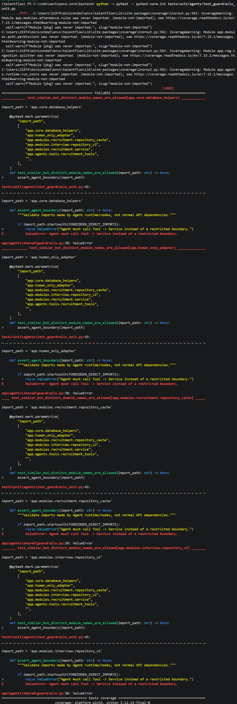
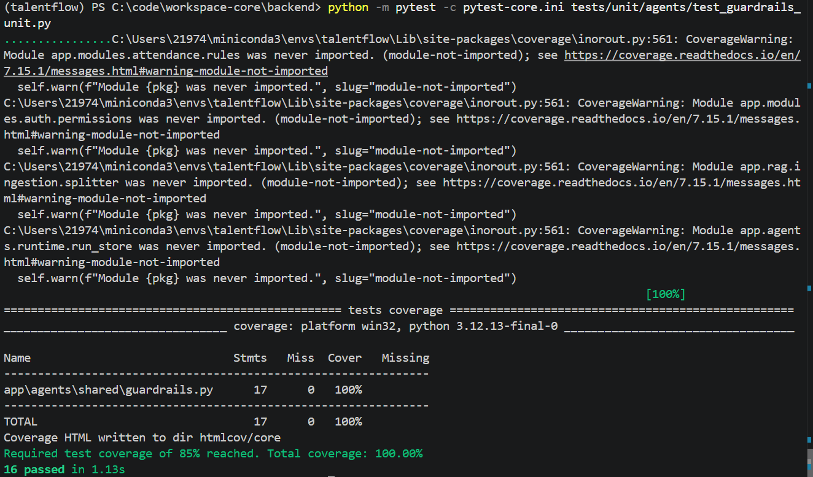

原实现：
workspace-core/backend/app/agents/shared/guardrails.py
```python
if import_path.startswith(FORBIDDEN_DIRECT_IMPORTS):
    raise ValueError(...)
```

`str.startswith(tuple)` 只比较字符串前缀，不识别 Python 模块的点号边界，因此以下合法模块也会被误判：

```text
app.core.database_helpers
app.human_only_adapter
app.modules.recruitment.repository_cache
app.modules.interview.repository_v2
```

测试结果：

```text
4 failed, 12 passed
```

修复后只拦截禁用模块本身及其真正的子模块：

```python
if any(
    import_path == forbidden or import_path.startswith(f"{forbidden}.")
    for forbidden in FORBIDDEN_DIRECT_IMPORTS
):
    raise ValueError(...)
```

回归结果：

```text
16 passed
```